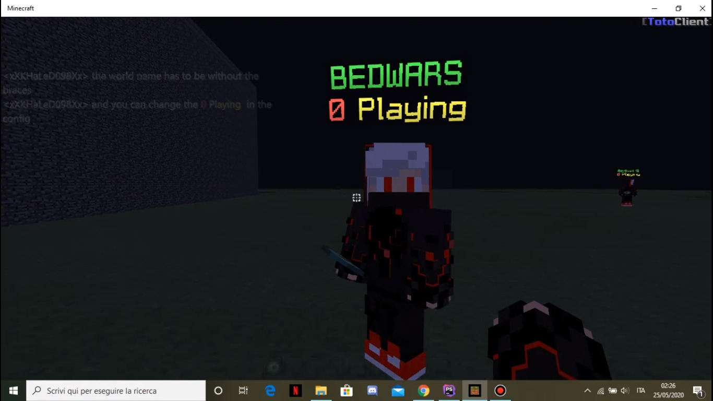

# WorldPlayerCount
This is a PocketMine-MP plugin that uses "Slapper" (Basically a Slapper addon) in order to show the player count of a specific world in the "Slapper"'s NameTag
## Usage
Click on the picture below, it will redirect you to a youtube video with the usage:

